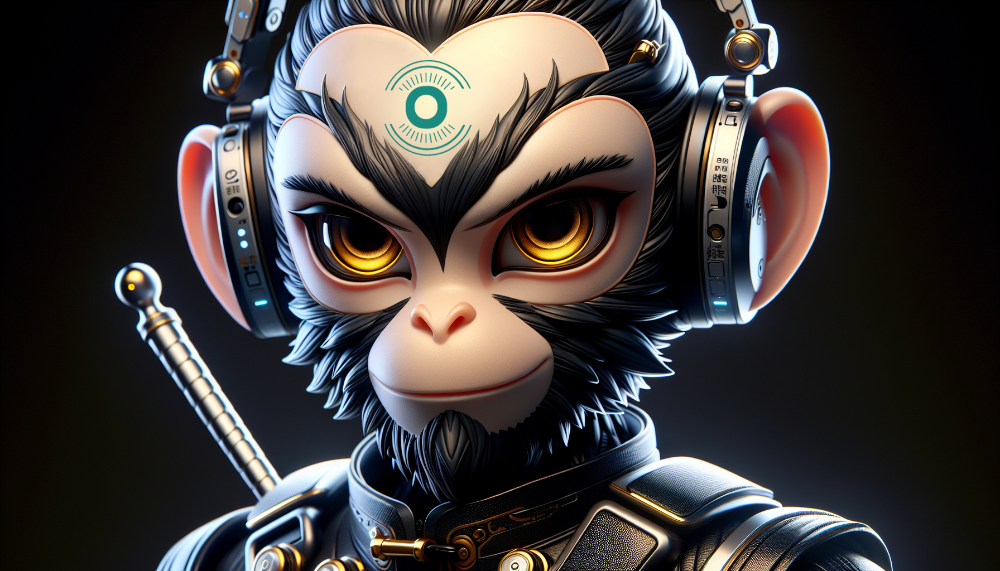

# CSG-VL: A family of small multimodal models

<p align="center">
  
</p>

CSG-VL is a family of small but strong multimodal models. It offers multiple plug-and-play vision encoders, like EVA-CLIP, SigLIP and language backbones, including Wukong-1B, Llama-3-8B, Phi-1.5, StableLM-2, Qwen1.5 and Phi-2. 


## News and Updates
* 2024.05.09 🔥 **CSG-VL is released!**

## Quickstart

### HuggingFace transformers

Here we show a code snippet to show you how to use [CSG-VL-1B-v0.1](https://huggingface.co/opencsg/csg-wukong-1B-VL-v0.1) with HuggingFace transformers.

Before running the snippet, you need to install the following dependencies:

```shell
pip install torch transformers accelerate pillow
```
```python
import torch
import transformers
from transformers import AutoModelForCausalLM, AutoTokenizer
from PIL import Image
import warnings

# disable some warnings
transformers.logging.set_verbosity_error()
transformers.logging.disable_progress_bar()
warnings.filterwarnings('ignore')

# set device
torch.set_default_device('cpu')  # or 'cuda'

model_name = 'opencsg/csg-wukong-1B-VL-v0.1'
# create model
model = AutoModelForCausalLM.from_pretrained(
    model_name,
    torch_dtype=torch.float16,
    device_map='auto',
    trust_remote_code=True)
tokenizer = AutoTokenizer.from_pretrained(
    model_name,
    trust_remote_code=True)

# text prompt
prompt = 'What is the astronaut holding in his hand?'
text = f"A chat between a curious user and an artificial intelligence assistant. The assistant gives helpful, detailed, and polite answers to the user's questions. USER: <image>\n{prompt} ASSISTANT:"
text_chunks = [tokenizer(chunk).input_ids for chunk in text.split('<image>')]
input_ids = torch.tensor(text_chunks[0] + [-200] + text_chunks[1], dtype=torch.long).unsqueeze(0)
image = Image.open('example_1.png')
image_tensor = model.process_images([image], model.config).to(dtype=model.dtype)

# generate
output_ids = model.generate(
    input_ids,
    images=image_tensor,
    max_new_tokens=100,
    use_cache=True)[0]

print(tokenizer.decode(output_ids[input_ids.shape[1]:], skip_special_tokens=True).strip())
```


## Install

* CUDA and cuDNN

  We use CUDA 11.8 and cuDNN 8.7.0. We actually use the CUDA docker by NVIDIA: `docker pull nvcr.io/nvidia/cuda:11.8.0-cudnn8-devel-ubuntu20.04`. CUDA 12 is fine, too.

* Create a conda virtual environment and activate it:

  ```shell
  conda create -n csg-vl python=3.10
  conda activate csg-vl
  ```

* Basic requirements

  ```shell
  pip install --upgrade pip  # enable PEP 660 support
  pip install transformers
  pip install torch torchvision xformers --index-url https://download.pytorch.org/whl/cu118
  ```

* Install apex

  ```shell
  # https://github.com/NVIDIA/apex#from-source
  pip install ninja
  git clone https://github.com/NVIDIA/apex
  cd apex
  # if pip >= 23.1 (ref: https://pip.pypa.io/en/stable/news/#v23-1) which supports multiple `--config-settings` with the same key...
  pip install -v --disable-pip-version-check --no-cache-dir --no-build-isolation --config-settings "--build-option=--cpp_ext" --config-settings "--build-option=--cuda_ext" ./
  # otherwise
  pip install -v --disable-pip-version-check --no-cache-dir --no-build-isolation --global-option="--cpp_ext" --global-option="--cuda_ext" ./
  ```

* Install flash-attention

  ```shell
  # https://github.com/Dao-AILab/flash-attention?tab=readme-ov-file#installation-and-features
  pip install packaging
  pip install flash-attn --no-build-isolation
  ```

* Install csg-vl and other requirements

  ```shell
  git clone https://github.com/OpenCSGs/CSG-VL.git
  cd CSG-VL
  pip install -e .
  ```


## Demo

### Gradio Web UI

* Launching the Gradio Web Server

  To interact with the models through a web interface, start the Gradio web server.

  Basic start:

  ```shell
  python -m csg_vl.serve.gradio_web_server \
  	--controller http://localhost:10000 \
  	--model-list-mode reload
  ```

  If you want to share your web server with others, use `--share` option. Note that `frpc_linux_amd64_v0.2` may be missing and you can fix it following instructions printed on the screen.

  ```shell
  python -m csg_vl.serve.gradio_web_server \
  	--controller http://localhost:10000 \
  	--model-list-mode reload \
  	--share
  ```

  Now, you can open the web interface with **the URL printed on the screen**. You may notice that there is no model in the model list. Do not worry, as we have not launched any model worker yet. It will be automatically updated when you launch a model worker.


* Starting the Controller

  First, start the controller. This service orchestrates communication between the web server and model workers.
  
  ```shell
  python -m csg_vl.serve.controller \
  	--host 0.0.0.0 \
  	--port 10000
  ```


* Launching Model Workers

  Model workers handle the processing of model inferences. Configure each worker with the appropriate model and start it.

  * For full-parameter tuning models

      ```shell
      python -m csg_vl.serve.model_worker \
        --host 0.0.0.0 \
        --controller http://localhost:10000 \
        --port 40000 \
        --worker http://localhost:40000 \
        --model-path /path/to/csg-vl/model \
        --model-type wukong
      ```

  * For LoRA tuning models

      You can use `script/merge_lora_weights.py` to merge the LoRA weights and base LLM, and use it as above.
      
      ```Shell
      python script/merge_lora_weights.py \
        --model-path /path/to/csg_vl_lora_weights \
        --model-base /path/to/base_llm_model \
        --model-type wukong \
        --save-model-path /path/to/merged_model
      ```
      Or you can use it without merging as below.
      
      ```shell
      python -m csg_vl.serve.model_worker \
        --host 0.0.0.0 \
        --controller http://localhost:10000 \
        --port 40000 \
        --worker http://localhost:40000 \
        --model-path /path/to/csg_vl_lora_weights \
        --model-base /path/to/base_llm_model \
        --model-type wukong
      ```


### CLI Inference (Without Gradio Interface)

For CLI-based inference without using the Gradio interface, use the following command:

* For full-parameter tuning models

  ```shell
  python -m csg_vl.serve.cli \
  	--model-path /path/to/csg-vl/model \
  	--model-type wukong \
  	--image-file /path/to/the/test/image
  ```

* For LoRA tuning models

  You can use `script/merge_lora_weights.py` to merge the LoRA weights and base LLM, and use it as above.

  ```Shell
  python script/merge_lora_weights.py \
  	--model-path /path/to/csg_vl_lora_weights \
  	--model-base /path/to/base_llm_model \
  	--model-type wukong \
  	--save-model-path /path/to/merged_model
  ```

  Or you can use it without merging as below.

  ```shell
  python -m csg_vl.serve.cli \
  	--model-path /path/to/csg_vl_lora_weights \
  	--model-base /path/to/base_llm_model \
  	--model-type wukong \
  	--image-file /path/to/the/test/image
  ```

## License
This project utilizes certain datasets and checkpoints that are subject to their respective original licenses. Users must comply with all terms and conditions of these original licenses.
The content of this project itself is licensed under the [Apache license 2.0](./LICENSE).

## Acknowledgement
We acknowledge all the open-source contributors for the following projects to make this work possible
* [Bunny](https://github.com/BAAI-DCAI/Bunny) | [LLaVA](https://github.com/haotian-liu/LLaVA)
